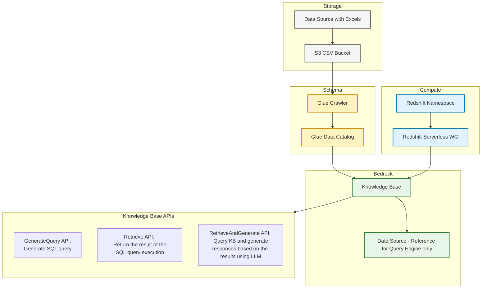

# Quick start with Amazon Bedrock Knowledge Bases 
Demo with Bedrock Knowledge Base (KB) powered by structured data store with CSV files

## Demo Solution Architecture


## Deployment guidelines with steps to setup

1. Deploy [cloudformation.yaml](cloudformation.yaml) with {alias}=demo
2. Upload CSV file ([CoffeeData.csv](CoffeeData.csv) or your own file) to a [S3 bucket](https://console.aws.amazon.com/s3/home) and run [Glue Crawler](https://console.aws.amazon.com/glue/home?#/v2/data-catalog/crawlers)
3. Once Redshift Namespace is provisioned, open [Redshift Query Editor V2](https://console.aws.amazon.com/sqlworkbench/home?#/client), login into demo-wg and run the following command:
```sql
CREATE USER "IAMR:demo-knowledge-base-role" WITH PASSWORD DISABLE;
GRANT USAGE ON DATABASE awsdatacatalog TO "IAMR:demo-knowledge-base-role";
```

3. Grant permissions to KB service role *demo-knowledge-base-role* through AWS Lake Formation. Open [AWS Lake Formation - Databases](https://console.aws.amazon.com/lakeformation/home?#/databases), select database *demo-kb* and grant Select/Describe permissions to KB service role:

| Config | Value |
|---|---|
| IAM users and roles | demo-knowledge-base-role |
| Named Data Catalog resources | |
| Catalogs | {account_id} |
| Databases | demo-kb |
| Tables | All Tables |
| Table permissions | Select/Describe |
   
5. Go to [Amazon Bedrock - Knowledge Bases](https://console.aws.amazon.com/bedrock/home?#/knowledge-bases) and open Knowledge Base with name "{alias}-knowledge-base-csv". Click Sync in Query Engine section.
6. Once Sync is in status Completed, click **Test Knowledge Base**
7. Select LLM (e.g. Anthropic - Claude 3.7. Sonnet ) and experiment with various APIs.
- What are key drink categories?
- Which category has the highest sales?
- Which region has the highest profit?
- What types of Espresso do we have?

## How to imptove Accuracy further

## References 
[How to allow KB service role to access structured data store](https://docs.aws.amazon.com/bedrock/latest/userguide/knowledge-base-prereq-structured.html#knowledge-base-prereq-structured-db-access)
