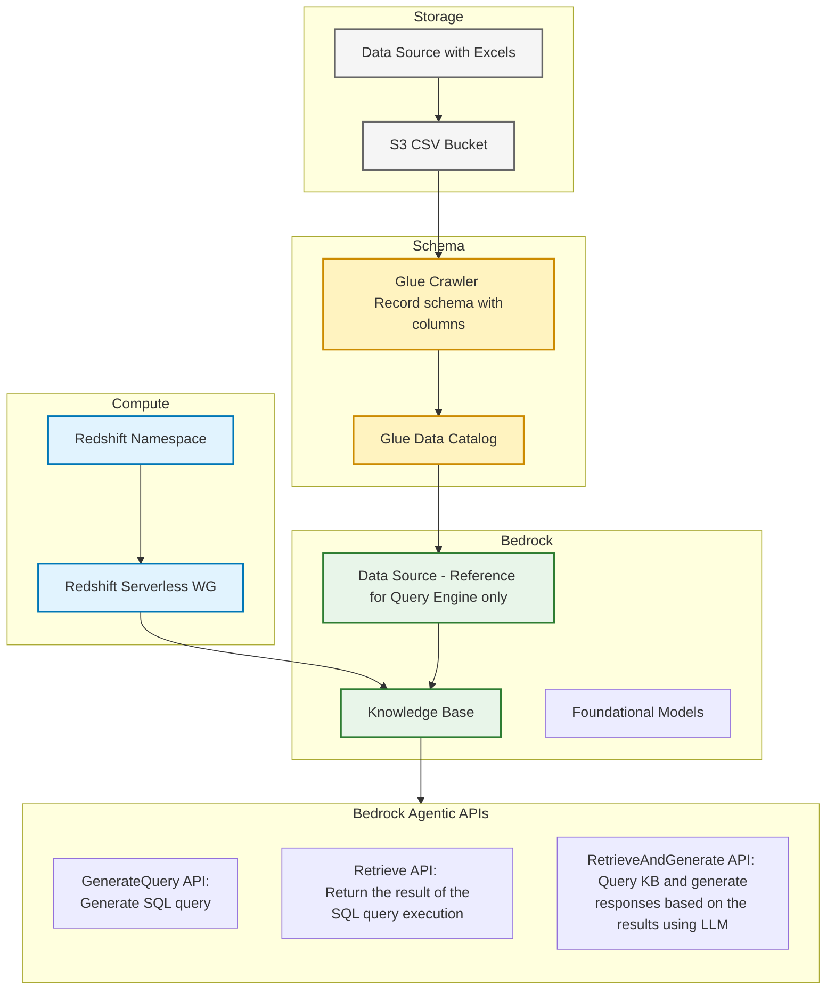

# Quick start with Amazon Bedrock Knowledge Bases 
Demo with Bedrock Knowledge Base (KB) powered by structured data store with CSV files

## Demo Solution Architecture


## Deployment guidelines with steps to setup

1. Deploy [cloudformation.yaml](cloudformation.yaml) with {alias}=demo
2. Upload CSV file ([CoffeeData.csv](data/CoffeeData.csv) or your own file) to a [S3 bucket](https://console.aws.amazon.com/s3/home) and run [Glue Crawler](https://console.aws.amazon.com/glue/home?#/v2/data-catalog/crawlers)
3. Once Redshift Namespace is provisioned, open [Redshift Query Editor V2](https://console.aws.amazon.com/sqlworkbench/home?#/client), login into demo-wg and run the following command:
```sql
CREATE USER "IAMR:demo-knowledge-base-role" WITH PASSWORD DISABLE;
GRANT USAGE ON DATABASE awsdatacatalog TO "IAMR:demo-knowledge-base-role";
```

4. Grant permissions to KB service role *demo-knowledge-base-role* through AWS Lake Formation. Open [AWS Lake Formation - Databases](https://console.aws.amazon.com/lakeformation/home?#/databases), select database *demo-kb* and grant Select/Describe permissions to KB service role:

| Config | Value |
|---|---|
| IAM users and roles | demo-knowledge-base-role |
| Named Data Catalog resources | |
| Catalogs | {account_id} |
| Databases | demo-kb |
| Tables | All Tables |
| Table permissions | Select/Describe |
   
5. Go to [Amazon Bedrock - Knowledge Bases](https://console.aws.amazon.com/bedrock/home?#/knowledge-bases) and open Knowledge Base with name "{alias}-knowledge-base-csv". Click Sync in Query Engine section.
6. Once Sync is in status Completed, click **Test Knowledge Base**
7. Select LLM (e.g. Anthropic - Claude 3.7. Sonnet ) and experiment with various APIs and natural language queries (NLQs):
> [!NOTE]
> Enable select model access here: [Bedrock Model Access](https://console.aws.amazon.com/bedrock/home?#/modelaccess)
> <br/>Click Modify model access and check interested LLM e.g. Anthropic Claude Sonnet

- What are key drink categories?
- Which category has the highest sales?
- Which region has the highest profit?
- What types of Espresso do we have?

8. Now open JupyterLab env from [Sagemaker Notebook](https://console.aws.amazon.com/sagemaker/home?#/notebooks-and-git-repos) and experiment with Bedrock APIs to run natural language queries (NLQ) and review response with SQL queries. This can help to create bank of curated queries for Knowledge Base configuration

## How to improve accuracy further

| Aspect | Recommendation | Where |
|---|---|---|
| Extra context about schema | Provides metadata or supplementary information about tables or columns <br/> This helps to reduce hallucinations os misleading interpretation of certain columns  | KB Query configurations - Description |
| NLQ examples | Provide a set of predefined question and answer examples. <br/> Questions are written as natural language queries (NLQ) and answers are the corresponding SQL query | KB Query configurations - Curated queries |
| Whitelisted/blacklisted columns | Specify a set of tables or columns to be included or excluded for SQL generation <br/> This helps fine-tune and guide LLM to rely on predefined query bank, especially for complex queries which might not be obvious from the schema | KB Query configurations - Inclusions and Exclusions |

## Understanding Cost

| Service | Usage | Dimentsion | Free p/month | Notes |
|---|---|---|---|---|
| Bedrock LLM | Token usage | Token count | | |
| Bedrock Knowledge Base | SQL Query generation | Query count | | |
| Glue | Catalog Requests | Request count | 1M requests | |
| Glue | Catalog Storage | Objects count | 1M objects | |
| Redshift Serverless | Compute | RPU/Hour | | This charge to be confirmed in context of KB. No charges for idleness |
| Lake Formation | Fine-grained Access | $0 | Always free | |
| Glue Crawler | Schema generation | DPU/Hour | | Can be replaced with other alternatives or schema recognized as part of the XLS2CSV processing |


## References 
[How to allow KB service role to access structured data store](https://docs.aws.amazon.com/bedrock/latest/userguide/knowledge-base-prereq-structured.html#knowledge-base-prereq-structured-db-access)
[Bedrock KB APIs for structured data](https://docs.aws.amazon.com/bedrock/latest/userguide/knowledge-base-generate-query.html)
